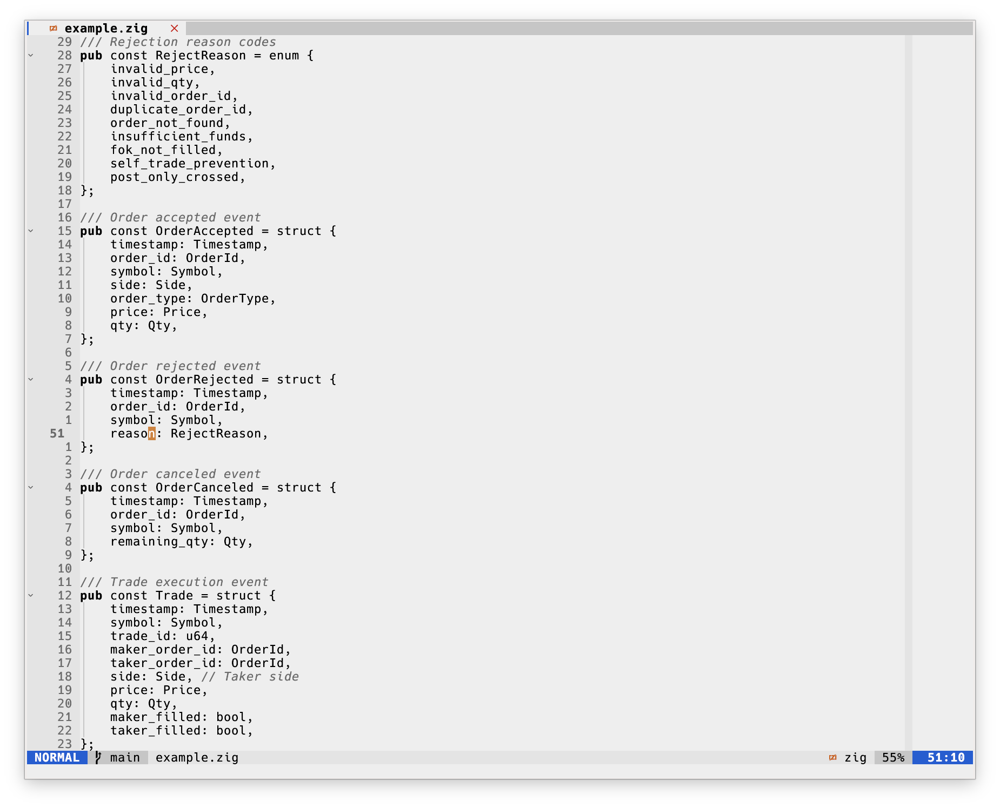
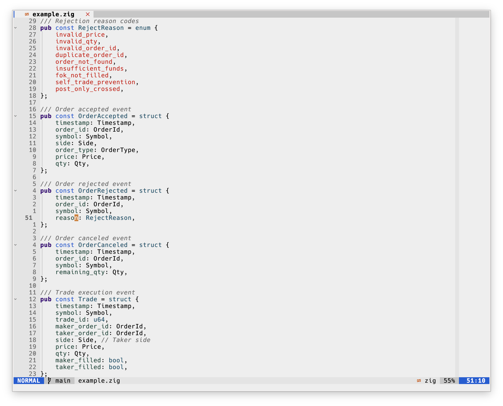

# envy.nvim

| envy                 | envy-colorful                          |
| -------------------- | -------------------------------------- |
|  |  |

A light Neovim colorscheme with comfortable contrast --- a modern Lua rewrite of
[Envy](https://github.com/kkga/vim-envy) by Gadzhi Kharkharov.

Ships two variants:

| Variant         | Feel                                                                                                                                                          |
| --------------- | ------------------------------------------------------------------------------------------------------------------------------------------------------------- |
| `envy`          | Minimal / near-monochrome --- black foreground, **bold** keywords, grey comments, green strings, blue numbers. The original look.                               |
| `envy-colorful` | Moderate extra syntax color --- keywords (purple), functions (blue), types (cyan), constants (red), muted properties/parameters. Still calm and light-friendly. |

Both share an identical UI and the same palette; only the syntax tokens differ.

## Table of Contents

- [Requirements](#requirements)
- [Install](#install)
    - [Requirements](#requirements)
    - [lazy.nvim](#lazynvim)
    - [packer.nvim](#packernvim)
- [Configuration](#configuration)
  - [Per-variant transparency](#per-variant-transparency)
- [Plugin support](#plugin-support)
  - [lualine](#lualine)
- [Credits](#credits)


## Install
### Requirements
- Neovim ≥ 0.8 with `termguicolors` (a true-color terminal or GUI).

### lazy.nvim

```lua
{
  "ogswag/envy.nvim", -- or your fork/path
  lazy = false,
  priority = 1000,
  opts = {},          -- see Configuration
  config = function(_, opts)
    require("envy").setup(opts)
    vim.cmd.colorscheme("envy") -- or "envy-colorful"
  end,
}
```

### packer.nvim

```lua
use({
  "ogswag/envy.nvim",
  config = function()
    require("envy").setup({})
    vim.cmd.colorscheme("envy")
  end,
})
```

## Configuration

`setup()` is optional. Defaults:

```lua
require("envy").setup({
  -- Background transparency, configured INDEPENDENTLY per variant.
  envy     = { transparent = false },
  colorful = { transparent = false },

  italic_comments = true,  -- comments in italic
  bold_keywords   = true,  -- bold keywords in the minimal `envy` variant
  terminal_colors = true,  -- set g:terminal_color_* from the palette

  -- Override or extend any highlight after the theme is built.
  on_highlights = function(hl, c)
    -- hl.Comment = { fg = c.grey, italic = false }
    -- hl.Normal  = { fg = c.fg, bg = c.white }
  end,
})
```

### Per-variant transparency

The two themes are separate colorschemes, so transparency is set per variant.
For example, an opaque `envy` but a transparent `envy-colorful`:

```lua
require("envy").setup({
  envy     = { transparent = false },
  colorful = { transparent = true },
})
```

When `transparent = true`, the main backgrounds (`Normal`, `NormalNC`,
`SignColumn`, `LineNr`, floats, statusline/tabline fills) become `NONE` for that
variant only.

## Plugin support

- Treesitter
- LSP semantic tokens & diagnostics
- Telescope
- nvim-cmp
- blink.cmp
- gitsigns
- neo-tree
- nvim-tree
- oil
- bufferline
- lualine
- indent-blankline
- which-key
- dashboard / alpha
- noice
- nvim-notify
- flash
- hop
- leap
- todo-comments
- trouble
- nvim-navic
- vim-illuminate
- mini.nvim
- rainbow-delimiters
- nvim-dap & dap-ui
- mason
- lazy.nvim
- neogit
- diffview
- fugitive
- ALE
- coc.nvim

### lualine

```lua
require("lualine").setup({ options = { theme = "envy" } })
-- theme = "envy-colorful" also works (shares the statusline palette)
```

## Credits

- Original vim-envy colorscheme: Gadzhi Kharkharov ([kkga/vim-envy](https://github.com/kkga/vim-envy))
- NeoVim maintenance: Alexander Zakharov
- License: MPL 2.0

The original `envy.colortemplate` is kept in this repo as a reference.
